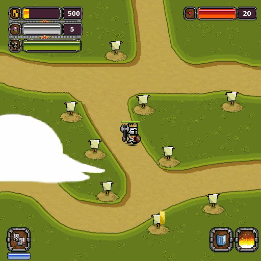
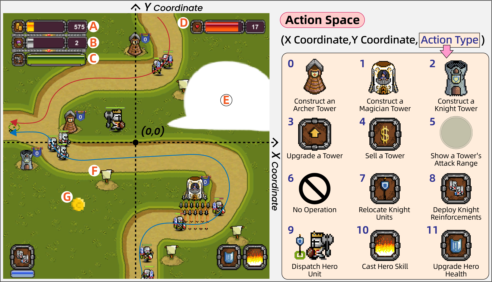

<h1 align="center">
  
  TowerMind
</h1>

<p align="center">
  
</p>

<p align="center">
  <em>GPT-4.1 playing TowerMind.</em>
</p>

# 📖 Introduction
This repository provides the official codebase for the paper "TowerMind: A Tower Defence Game Learning Environment and Benchmark for LLM as Agents." The paper is available on [arXiv](https://arxiv.org/abs/2601.05899). Detailed information and implementation specifics of TowerMind can be found in the paper.

# 📦 Getting Started

## 1.Clone the Repo:
```bash
git clone git@github.com:tb6147877/TowerMind.git

cd TowerMind
```

## 2.Extracted the Env:
```bash
unzip compressed_env/linux.zip -d extracted/

chmod +x ./extracted/linux/td.x86_64
```

## 3.1Play as a Human:
```bash
./extracted/linux/td.x86_64
```

## 3.2Use as a Gym Env:
```bash
conda create -n towermind python=3.10.12 && conda activate towermind

python -m pip install mlagents==1.1.0

python ./hello_world.py
```

# 📑 Documentation

Obs Space:
Pixel-Based, Textual, and Structured Game-State

Action Space (Please refer to the following figure):
<p align="center">
  
</p>

About Env Basic Settings:
TowerMind is built upon the Unity ML-Agents Toolkit. For more details on customizing features, please refer to the official Unity ML-Agents [documentation](https://github.com/Unity-Technologies/ml-agents).

TowerMind Customizability:
Directory`./extracted/linux/td_Data/StreamingAssets/Config`includes all configurable files for TowerMind, which control various utility features and property settings of environment elements.


Possible Problems:
1.[Vulkan](https://vulkan.lunarg.com/sdk/home) may need to be installed when CPU rendering is required.

# 🚀 Roadmap
As our team is currently engaged in other ongoing research projects, this repository is not yet fully polished. However, we will continue to actively maintain and update it.

The level editor will be released soon.

Please note that the current version of TowerMind already fully supports both LLM-based and RL-based evaluations. 

# 📚 Citation

If you find this work useful, please cite:

```bibtex
@article{wang2026towermind,
  title={TowerMind: A Tower Defence Game Learning Environment and Benchmark for LLM as Agents},
  author={Wang, Dawei and Zhou, Chengming and Zhao, Di and Liu, Xinyuan and Ma, Marci Chi and Ushaw, Gary and Davison, Richard},
  journal={arXiv preprint arXiv:2601.05899},
  year={2026}
}
