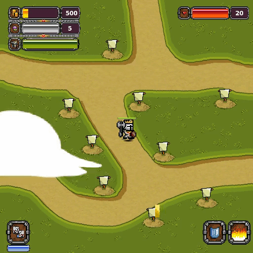

<h1 align="center">
  
  TowerMind
</h1>

<p align="center">
  
</p>

<p align="center">
  <em>GPT-4.1 playing TowerMind.</em>
</p>

# 📖 Introduction
This repository provides the official codebase (including the TowerMind environment executables, the Gym interface, and the accompanying Level Editor) for the paper "TowerMind: A Tower Defence Game Learning Environment and Benchmark for LLM as Agents." The paper is available on [arXiv](https://arxiv.org/abs/2601.05899). Detailed information and implementation specifics of TowerMind can be found in the paper.


# 📦 Getting Started

## 1.Clone the Repo:
```bash
git clone git@github.com:tb6147877/TowerMind.git

cd TowerMind
```

## 2.Extracted the Env:
```bash
unzip compressed_env/linux.zip -d extracted/

chmod +x ./extracted/linux/td.x86_64
```

## 3.1Play as a Human:
```bash
./extracted/linux/td.x86_64
```
For **Windows** users, simply extract windows.zip in `./compressed_env` to get started.

**macOS** versions (for both Apple Silicon and Intel) require two additional steps after extraction in order to run properly on a Mac:
1. Run ```xattr -dr com.apple.quarantine td.app``` in the directory where you extracted the files.

2. Run ```chmod +x YourGame.app/Contents/MacOS/*``` in the same directory.

3. Then, you can launch the app by clicking the icon. If macOS prompts for permissions, go to System Settings > Privacy & Security to allow the app to run.

## 3.2Use as a Gym Env:
```bash
conda create -n towermind python=3.10.12 && conda activate towermind

python -m pip install mlagents==1.1.0

python ./hello_world.py
```

# 📑 Documentation

See [guide.md](./guide.md).


# 🗺️ Level Editor

The Level Editor provided with TowerMind allows researchers to create custom levels. The executable files and documentation are located in the `level_editor` folder.


# 🚀 Roadmap

Please note that the current version of TowerMind already fully supports both LLM-based and RL-based evaluations. We will continue to improve the relevant documentation, particularly the explanations of certain settings. If researchers encounter any issues while using the environment, they are encouraged to open an issue or contact the first author directly by email.


# 📚 Citation

If you find this work useful, please cite:

```bibtex
@article{wang2026towermind,
  title={TowerMind: A Tower Defence Game Learning Environment and Benchmark for LLM as Agents},
  author={Wang, Dawei and Zhou, Chengming and Zhao, Di and Liu, Xinyuan and Ma, Marci Chi and Ushaw, Gary and Davison, Richard},
  journal={arXiv preprint arXiv:2601.05899},
  year={2026}
}
