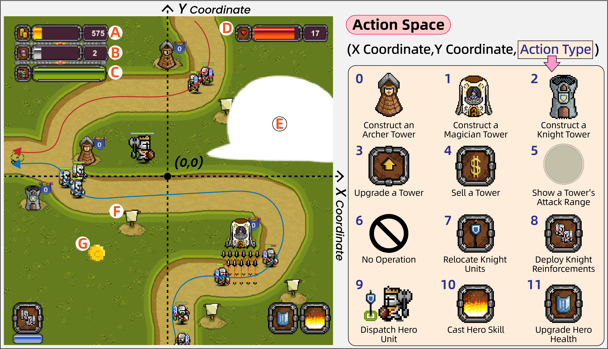

# 📑 TowerMind Documentation (🔥Ongoing Updates)

## 1. General Information

About Environment Basic Settings:
TowerMind is built upon the Unity ML-Agents Toolkit. For more details on customizing features, please refer to the official Unity ML-Agents [documentation](https://github.com/Unity-Technologies/ml-agents).

Observation Space:
Pixel-based (512 x 512 x 3), textual, and structured game-state.

Action Space (Please refer to the following figure):
 X Coordinate $\in$ [-3.0, 3.0], Y Coordinate $\in$ [-3.0, 3.0], Action Type $\in$ {0, 1, 2, 3, 4, 5, 6, 7, 8, 9, 10, 11}. 
For example, the action (-1.5, 1.2, 2) means "construct a Knight Tower at the location on the map with x-coordinate of -1.5 and y-coordinate of 1.2".

  

## 2. Configuration Table Description

The `td_Data/StreamingAssets/Config` directory under the TowerMind executable contains all configurable files for TowerMind. These files control various utility features and property settings of environment elements. This section provides a detailed explanation of the meaning and usage of each configuration table.

1. How to select different benchmark levels by modifying the configuration: Different benchmark levels can be selected by modifying the `CurrentLevel` field in the `FixedLevelsConfig` file. Valid values are integers ranging from `0` to `8`, meaning that TowerMind provides 9 built-in benchmark levels. Please DO NOT modify the `CustomLevelsConfig` file until the **Level Editor** is officially released.

## 3. Other Notes:
### 3.1 [Vulkan](https://vulkan.lunarg.com/sdk/home) may need to be installed when CPU rendering is required.