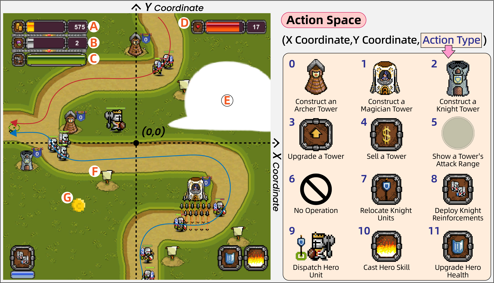

# 📑 TowerMind Documentation (🔥Ongoing Updates)

## 1. General Information

About Environment Basic Settings:
TowerMind is built upon the Unity ML-Agents Toolkit. For more details on customizing features, please refer to the official Unity ML-Agents [documentation](https://github.com/Unity-Technologies/ml-agents).

Observation Space:
Pixel-based (512 x 512 x 3), textual, and structured game-state.

Action Space (Please refer to the following figure):
 X Coordinate $\in$ [-3.0, 3.0], Y Coordinate $\in$ [-3.0, 3.0], Action Type $\in$ {0, 1, 2, 3, 4, 5, 6, 7, 8, 9, 10, 11}. 
For example, the action (-1.5, 1.2, 2) means "construct a Knight Tower at the location on the map with x-coordinate of -1.5 and y-coordinate of 1.2".

  

## 2. Configuration Table Description

The `td_Data/StreamingAssets/Config` directory under the TowerMind executable contains all configurable files for TowerMind. These files control various utility features and property settings of environment elements. This section provides a detailed explanation of the meaning and usage of each configuration table.

### EnvConfig.json:
1.`GeneralizationLevel`: This field specifies the degree of generalization applied to level selection:
* `0`—FixedLevels: Repeatedly runs the level specified by the `CurrentLevel` field in `FixedLevelsConfig.json`.
* `1`—RandomLevels: Randomly selects a level for each episode from the level-list configuration file specified by `LevelsConfigFileName`.
* `2`—RandomLevelsRandomWaves: Randomly selects a level for each episode from the level-list configuration file specified by `LevelsConfigFileName`. The enemy waves for the selected level are also randomly sampled from `AllWavesConfig.json`.

2.`NeedsNaturalLanguageObservation`: Whether to enable test observations: 0—disabled; 1—enabled.

3.`NeedsRealtimeLanguageObservation`: Whether to enable real-time text observations, such as each enemy’s health and position at every environment step: `0`—disabled; `1`—enabled. This feature takes effect only when `NeedsNaturalLanguageObservation` is set to `1`.

4.`IsOnlyPixelObs`: This field indicates whether the TowerMind environment uses pixel observations exclusively: `0`—no; `1`—yes. To enable text observations, ensure that this field is set to `0`. When only pixel observations are required, setting this field to `1` can improve the environment’s execution speed.

5.`LevelsConfigFileName`: This field specifies the level-list configuration file used by TowerMind. `BenchmarkLevelsConfig.json` contains the nine built-in benchmark levels, while `CustomLevelsConfig.json` provides an example configuration for custom levels.

6.`IsHumanPlayerPlaying`: This field indicates whether TowerMind is being played by a human: `0`—no; `1`—yes. When set to `1`, a user interface designed for human players will be displayed.

### FixedLevelsConfig.json:
1.`CurrentLevel`: Different benchmark levels can be selected by modifying this field. This field can be used to specify the level only when the `GeneralizationLevel` field in `EnvConfig.json` is set to `0`—FixedLevels. It has no effect when `GeneralizationLevel` is set to any other value. It needs to fill the level `ID` in the level-list configuration file specified by the `LevelsConfigFileName` field in `EnvConfig.json`.

  

## 3. Other Notes:
### 3.1 [Vulkan](https://vulkan.lunarg.com/sdk/home) may need to be installed when CPU rendering is required.