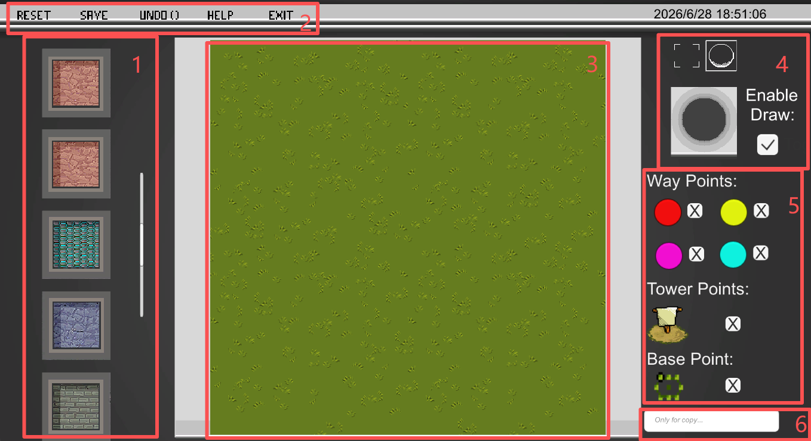
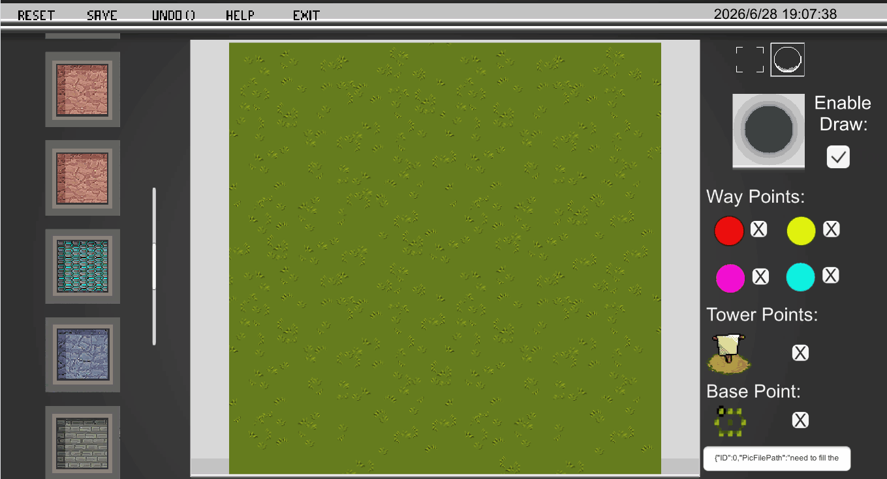
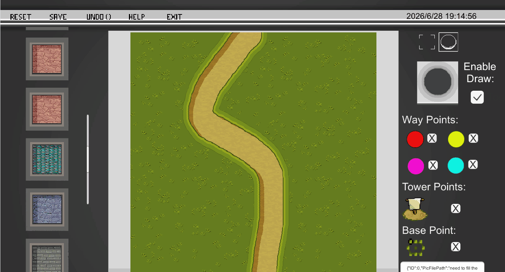
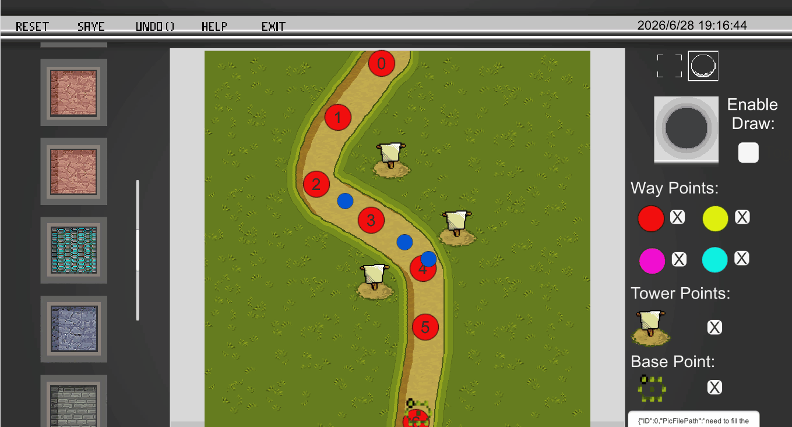
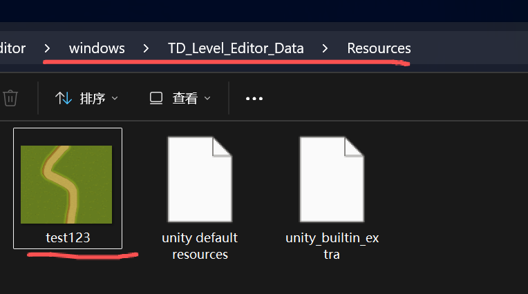
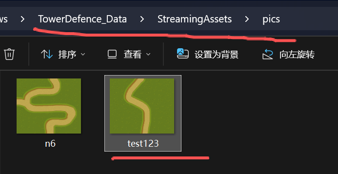
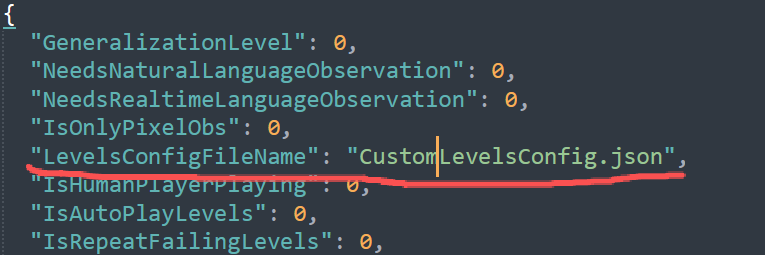
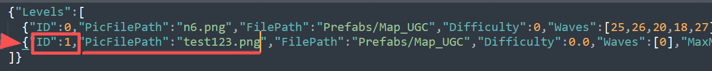
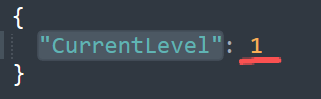

# TowerMind Level Editor Step-by-Step Guide

In the `level_editor` folder under the TowerMind directory, select the Level Editor version for your operating system. After extracting the archive, the editor can be used directly.

<table align="center">
  <tr>
    <td>
      
       
      

        <strong>Figure:</strong> The interface of the Level Editor. Area 1 is the appearance selection panel, where users can choose the map background and road style. Area 2 is the function panel, which provides operations related to the map brush. Area 3 is the map canvas. Area 4 is the brush options panel, where users can select the brush size and style. Area 5 is the map element selection panel, where enemy attack waypoints, tower-building points, and the player base can be dragged onto the map. Area 6 is the copy area for the generated map file in JSON format.
      

    </td>
  </tr>
</table>

## 1. Operations in the Level Editor

### Draw the road while ensuring that **Enable Draw** is checked.

  

### Make sure **Enable Draw** is unchecked before dragging enemy attack waypoints, tower-building points, and the base onto the map. All three types of elements can be removed by clicking **X**. There are four colors of enemy attack waypoints. Each color represents one enemy attack path, meaning that the editor supports up to four enemy attack paths on a map. The tower-building points include a draggable blue point, which is used to indicate the default rally position for knights generated by the Knight Tower.

  

### After completing the map, click the **SAVE** button to save the map image with a name of your choice. Then, press **Ctrl+C** to copy the automatically generated level data in JSON format.

  

## 2. Integrating the Generated Level into TowerMind

Find the map image you just saved under the `TD_Level_Editor_Data\Resources` directory in the Level Editor folder.

  

Copy this image to the `TowerDefence_Data\StreamingAssets\pics` directory under the TowerMind executable directory.

  

In the TowerMind executable directory, locate the `EnvConfig.json` file under `TowerDefence_Data\StreamingAssets\Config`. Open the file and change the value of the `"LevelsConfigFileName"` field to `"CustomLevelsConfig.json"`.

  

In the TowerMind executable directory, locate the `CustomLevelsConfig.json` file under `TowerDefence_Data\StreamingAssets\Config`. Open the file and paste the JSON-formatted level data generated by the Level Editor into the `"Levels"` array. Assign a unique number to the `"ID"` field, and set the `"PicFilePath"` field to the filename of the map image generated by the Level Editor.

  

In the TowerMind executable directory, locate the `FixedLevelsConfig.json` file under `TowerDefence_Data\StreamingAssets\Config`. Open the file and change the value of the `"CurrentLevel"` field to the ID of the level you set in `CustomLevelsConfig.json` in the previous step.

  

## Play the Game Normally

After completing the steps above, you can use your custom level in TowerMind.

  

Other TowerMind game settings are consistent with the other documentation of this project and can be adjusted according to your needs.

If you have any questions, please open an issue or contact the first author of TowerMind by email.
